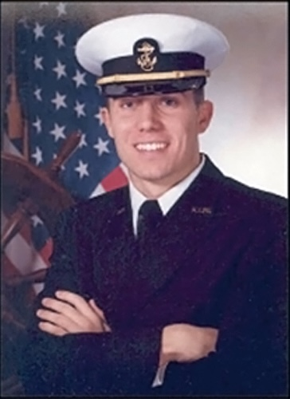

::: {.content-visible when-format="html"}
::: {layout="[30,70]"}
{fig-alt="J. Kyle Hurdle" width="150px"}

::: {}
### In Memory of J. Kyle Hurdle
August 6, 1980 - August 10, 2001

An annual scholarship awarded by the Greater Peninsula Swimming Association to graduating seniors each summer, honoring Kyle's determination, integrity, and leadership both in the water and in life.
:::
:::
:::

::: {.content-visible when-format="pdf"}
```{=latex}
\begin{center}
\includegraphics[width=1.5in]{assets/scholarships/J.Kyle_Hurdle.jpg}

\vspace{0.5em}
{\large\textbf{In Memory of J. Kyle Hurdle}}\\
August 6, 1980 -- August 10, 2001

\vspace{0.5em}
\begin{minipage}{0.85\textwidth}
\centering
An annual scholarship awarded by the Greater Peninsula Swimming Association to graduating seniors each summer, honoring Kyle's determination, integrity, and leadership both in the water and in life.
\end{minipage}
\end{center}
```
:::

---

##  Essay Topic

> "What positive impact has summer swimming had on your life? How do you intend to pay this forward?"

## Eligibility

Entrants must be recently graduated high school seniors (or seniors who have already completed their final year of GPSA eligibility) who are planning to advance their education (college, trade school, apprenticeship, etc.) in the upcoming academic year.

## Essay Requirements

- Minimum 300 words, maximum 700 words
- Submit as Microsoft Word, Google Docs, or similar format
- Attach to this completed application

## Submission

Submit this completed application and essay to your team's GPSA Representative. The representative's submission serves as their recommendation of the applicant's leadership, work ethic, and sportsmanship.

**Deadline:** All entries must be emailed by the GPSA Representative to [scholarships@gpsaswimming.org](mailto:scholarships@gpsaswimming.org) with subject "GPSA Scholarship" by **midnight, **.

Winners will be announced at the Championship Meet on .



## Applicant Information

```{=latex}
\renewcommand{\arraystretch}{2.2}
\begin{Form}
\begin{tabular}{@{}p{4cm}p{10cm}@{}}
Date of Application & \TextField[name=date, width=10cm, bordercolor={0 0.14 0.4}]{} \\
Name of Applicant & \TextField[name=name, width=10cm, bordercolor={0 0.14 0.4}]{} \\
Address & \TextField[name=address1, width=10cm, bordercolor={0 0.14 0.4}]{} \\
& \TextField[name=address2, width=10cm, bordercolor={0 0.14 0.4}]{} \\
Telephone & \TextField[name=phone, width=10cm, bordercolor={0 0.14 0.4}]{} \\
Date of Birth & \TextField[name=dob, width=10cm, bordercolor={0 0.14 0.4}]{} \\
Pool Represented & \TextField[name=pool, width=10cm, bordercolor={0 0.14 0.4}]{} \\
Years in GPSA & \TextField[name=years, width=10cm, bordercolor={0 0.14 0.4}]{} \\
Favorite Stroke & \TextField[name=stroke, width=10cm, bordercolor={0 0.14 0.4}]{} \\
\end{tabular}
```

## Education Plans

```{=latex}
\begin{tabular}{@{}p{4cm}p{10cm}@{}}
School to Attend & \TextField[name=school, width=10cm, bordercolor={0 0.14 0.4}]{} \\
Already Accepted? & \CheckBox[name=acceptedYes, bordercolor={0 0.14 0.4}]{} Yes \hspace{1.5cm} \CheckBox[name=acceptedNo, bordercolor={0 0.14 0.4}]{} No \\
Intended Major & \TextField[name=major, width=10cm, bordercolor={0 0.14 0.4}]{} \\
\end{tabular}
\end{Form}

\vspace{2em}
```

::: {.text-center .small}
For more information, see the [J. Kyle Hurdle Scholarship](hurdle-scholarship.md) page.
:::
