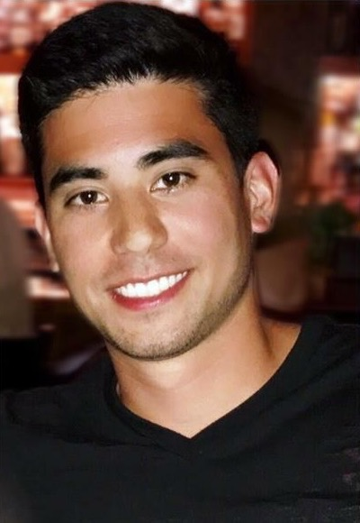

The Kei Lamberson Outstanding Coach Award is an annual $500 award presented to a GPSA coach who exemplifies joy, compassion, and companionship in connecting with swimmers. Coaches are nominated by GPSA families, and a winner is selected each summer.

## Who Was Kei Lamberson?

::: {.grid}
::: {.g-col-12 .g-col-md-4}
{fig-alt="Kei Lamberson"}

::: {.text-center .small .text-muted}
**Kei Lamberson** 
1991 - 2018
:::
:::

::: {.g-col-12 .g-col-md-8}
Kei grew up heavily involved in swimming, competing for SEVA, Typhoon Aquatics, CGBD, Marlbank Mudtoads, and York High. He became a coach for Marlbank for two summers before passing away in 2018 at 27 years old.

Kei approached life with an unbelievable amount of joy, compassion, and companionship. He strove every day to pursue living life to the fullest, connecting with those around him and letting nothing slow him down. He cared deeply about others, without expecting any reciprocation.

His enjoyment in connecting with others was exemplified in his approach towards coaching, where he made a point to connect with each swimmer, enabling and supporting each swimmer to find their passion in the sport. His ability to bring out the best in each individual led swimmers to look up to him and parents to appreciate his team leadership.

The Kei Lamberson Award goes to the coach that best exemplifies these qualities, displaying their passion for the sport and connecting with each swimmer.
:::
:::

## Award Details

- **Award Amount:** $500, funded by an annual contribution from the Lamberson family
- **Recipients:** One coach or team of co-coaches per season
- **Nomination:** By GPSA families through their team's GPSA Representative

## Nomination Process

This is a **nomination award**, not an application. GPSA Representatives may nominate a coach and seek someone familiar with that coach to draft the nomination essay.

### Step 1: Download the Nomination Form

Download and fill out the [Nomination Form](lamberson-award-form.pdf).

### Step 2: Write the Nomination Essay

**2025 Essay Topic:** "How has your coach demonstrated joy, compassion and companionship in connecting with all swimmers on your team this summer?"

**Essay Requirements:**

- Minimum 250 words, maximum 750 words
- Submit in Microsoft Word, Google Docs, or similar format

### Step 3: Submit to Your GPSA Representative

Submit the completed nomination form and essay to your team's [GPSA Representative](gpsa-rep-duties.md).

### Step 4: Representative Submits to GPSA

The GPSA Representative will email the nomination to [scholarships@gpsaswimming.org](mailto:scholarships@gpsaswimming.org) with the subject line "Kei Lamberson Coach Award."

## Deadline

All entries must be emailed by the GPSA Representative by **midnight, Sunday, July 27, 2025**.

## Award Announcement

The winner will be announced during the **Championship Meet (City Meet)**.

## Related Resources

- [Nomination Form](lamberson-award-form.pdf) - Download and complete the nomination
- [J. Kyle Hurdle Scholarship](hurdle-scholarship.md) - GPSA's scholarship for graduating swimmers
- [About GPSA](about.md) - Learn more about the league
