This comprehensive guide provides GPSA team administrators with step-by-step instructions for using SwimTopia to manage rosters, registration, meet setup, and swim meet execution throughout the season.

## Quick Reference

- **Managing rosters:** [People](#people)
- **Setting up registration:** [Registration](#registration)
- **Creating meet templates:** [Job Templates](#job-templates)
- **Entering swimmers in meets:** [Swimmer Entries](#swimmer-entries)
- **Running meets:** [Running the Meet](#running-the-meet)
- **Exporting results:** [Export Meet Results](#export-meet-results-to-teams-repository)

## People

Managing your team roster is the foundation of using SwimTopia effectively.

**Official Documentation:** [Managing Your People/Roster – SwimTopia Help Center](https://help.swimtopia.com/hc/en-us/articles/200783338-Managing-Your-People-Roster#h_911c3a87-d13c-4ed8-ba8e-ab64cc971edd)

### Swimmer / Parent Account Deletion

If a swimmer leaves your pool, you will need to email <help@swimtopia.com> asking they remove the team association with the necessary email accounts.

**Note:** SwimTopia support must handle account deletions - team administrators cannot remove associations directly.

## Roles

Roles allow you to organize people into groups for efficient communication and manage access within the Manage Team area. Any parent or athlete on your team can be assigned to a role for grouping purposes, from assigning meet jobs to sending group emails.

**Official Documentation:** [Defining Roles](https://help.swimtopia.com/hc/en-us/articles/200783278-Defining-Roles)

### League Shared Roles

Some roles are created and shared from the League level. This allows league administrators to send targeted communications to each group if required. While the name of these roles cannot be changed, the other attributes can be modified locally in your team site.

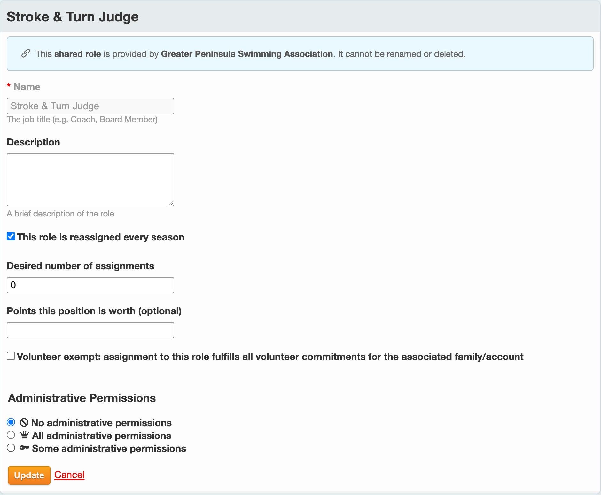

## Registration

SwimTopia's registration system handles team signups, waivers, and payments.

**Official Documentation:** [Registration – SwimTopia Help Center](https://help.swimtopia.com/hc/en-us/sections/200208518-Registration)

### Team Waiver

To add or edit team waivers:

1. Click on the **Registration** header
2. Select your team registration form (e.g., '2024 Team Swim Registration')

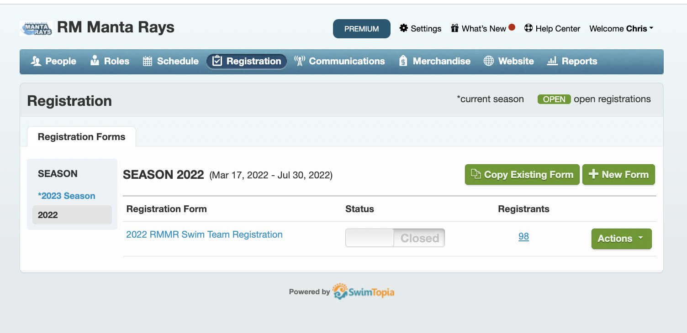

3. Scroll down to the **Acknowledgments** section
4. Create any Team Acknowledgment document to include in your registration form

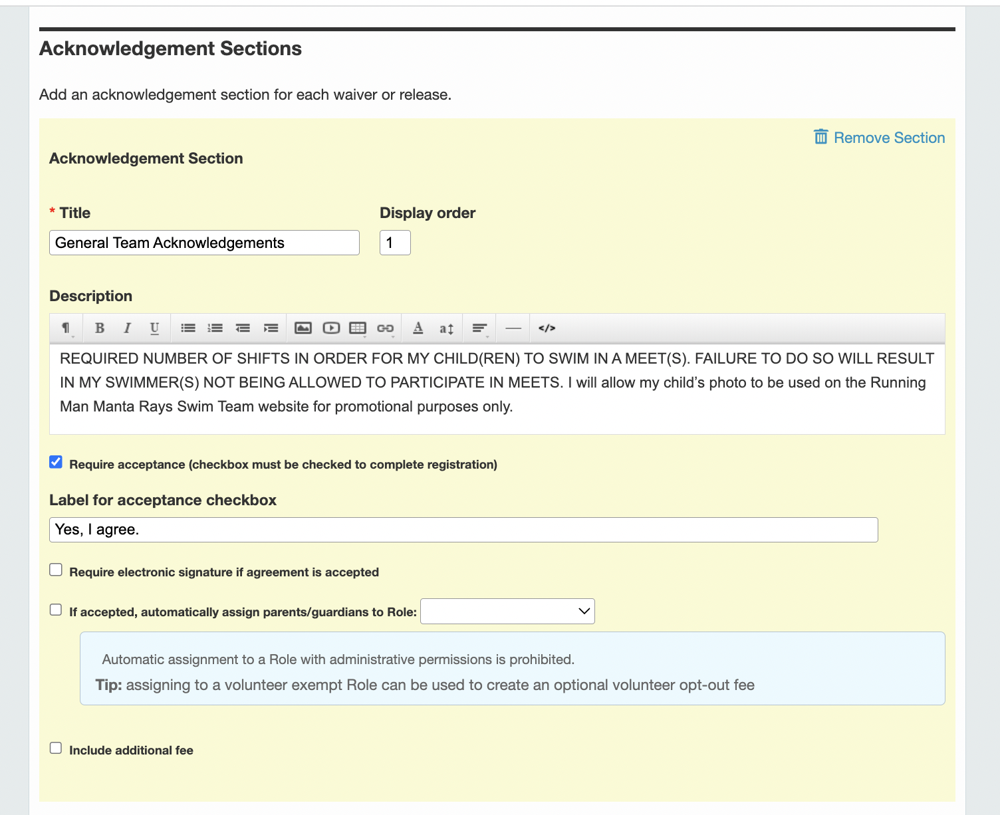

### GPSA Code of Conduct and City Meet Waiver

The GPSA Code of Conduct and City Meet Waiver can be imported in the Registration form, Acknowledgments section.

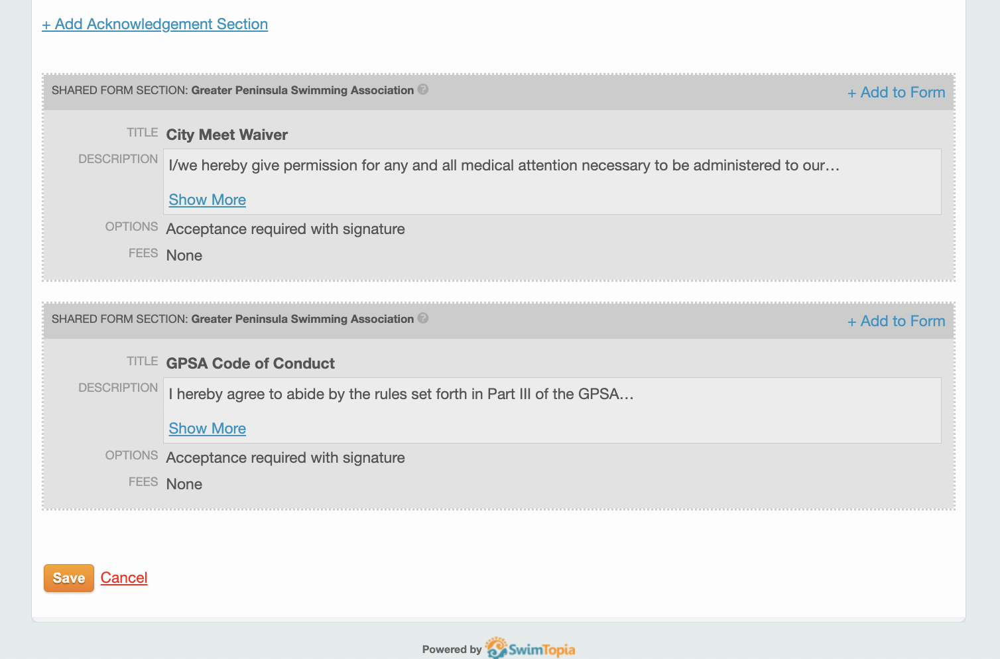

### Payment

SwimTopia integrates with Stripe for online payment processing.

**Official Documentation:** [Stripe Account Setup](https://help.swimtopia.com/hc/en-us/articles/4413543731483-Stripe-Account-Setup)

## Schedule

### Meet Schedule

The league will submit the approved division schedules to SwimTopia to be automatically created into each team's schedule.

**Note:** You don't need to manually create regular season dual meets - these are automatically populated by GPSA league administrators.

### Meet Templates

The league will share the necessary meet templates for all GPSA official meets. If you have the need for a custom meet template you may create one yourself. If you will be swimming against multiple GPSA pools and would like a league shared template for each team to use, please reach out to the webmaster with the specific details.

### Job Templates

Job templates define volunteer roles needed for home and away meets.

To configure job templates:

1. Click on **Schedule**
2. Click on the **Job Templates** tab
3. Define templates for Home and Away meets

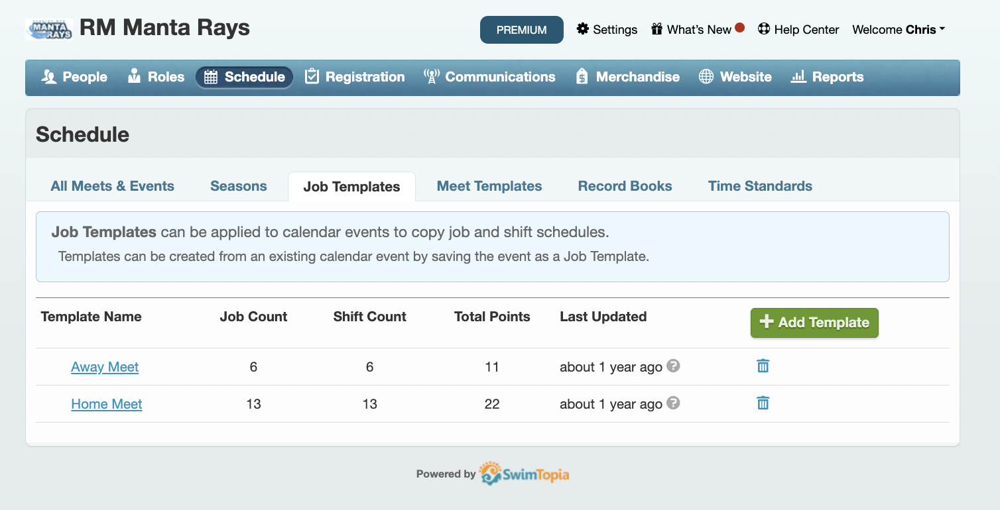

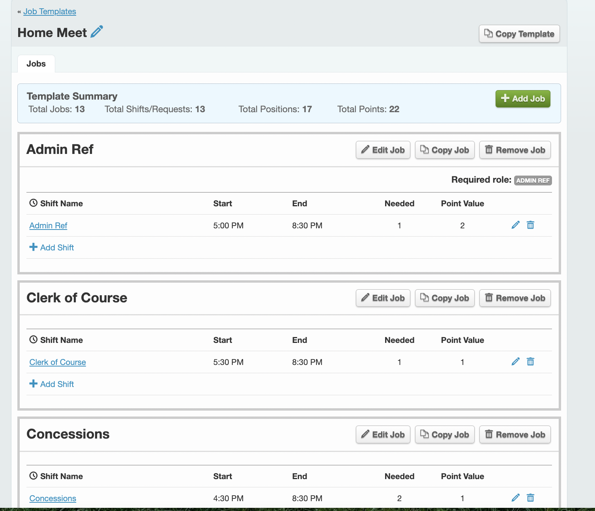

#### Home Meet Roles

Home meets will typically include the following roles:

- Meet Ref
- Admin Ref
- Starter
- Timers
- Head Timer
- Runner
- Concessions
- Clerk of Course
- Ribbon Writer
- Scorekeeper
- Stroke and Turn Judges
- Sweep Judge

#### Away Meet Roles

Away meets will typically require:

- Clerk of Course
- Ribbon Writer
- Scorekeeper
- Timers
- Stroke and Turn Judges
- Sweep Judge

## Creating Record Books

Record books track team and pool records over time.

**Official Documentation:**
- [Creating a Record Book](https://help.swimtopia.com/hc/en-us/articles/360022227232-Creating-a-Record-Book)
- [Managing a Record Book](https://help.swimtopia.com/hc/en-us/articles/360022469891)

### Importing City Meet Qualifying Times

City Meet Qualifying Times will be published from the league to all teams.

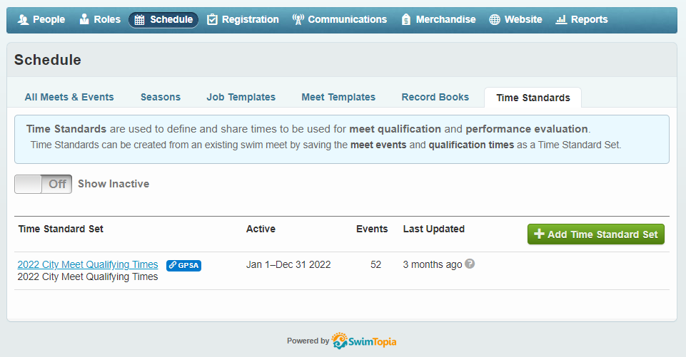

## Team Website

SwimTopia provides customizable team website features.

**Official Documentation:** [Website Management](https://help.swimtopia.com/hc/en-us/sections/200208468-Website-Management)

## Meet Setup

Regular season meets will be submitted to SwimTopia and automatically linked to your team schedule. To create a time-trial, mock-meet, or B-meet, follow these steps:

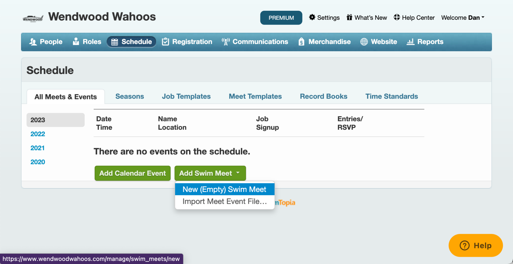

1. On the Schedule screen select **Add Swim Meet** and then **New (Empty) Swim Meet**

2. Enter the Meet Details:
   - [Meet Name](https://help.swimtopia.com/hc/en-us/articles/360037969511#h_67f0fce7-bb69-4434-8653-01cf8d736aa0)
   - [Start, End, & Warm-up (Date/Time)](https://help.swimtopia.com/hc/en-us/articles/360037969511#h_28ac0beb-a636-436c-810f-60144bd06a6c)
   - [Location](https://help.swimtopia.com/hc/en-us/articles/360037969511#h_8ea3c4b7-1107-4503-ad06-7a271373164a)
   - [Description](https://help.swimtopia.com/hc/en-us/articles/360037969511#h_f18a38aa-5718-4a04-8b84-36fdd93813ce)
   - [Hide from Public Calendar](https://help.swimtopia.com/hc/en-us/articles/360037969511#h_65b1a305-562f-41d1-b949-fc3d211cfd88)
   - [Age-Up Date](https://help.swimtopia.com/hc/en-us/articles/360037969511#h_07e2fc90-2c81-4ed0-a06e-38bf8e6baa48)
   - [Course (pool length)](https://help.swimtopia.com/hc/en-us/articles/360037969511#h_0920d58b-9344-49c3-9804-40f50685e5d6)
   - [Entry Time Conversion](https://help.swimtopia.com/hc/en-us/articles/360037969511#h_69eceb1d-dfd5-4bd5-9e9e-e2bb5d29a71f)

3. Edit Swimmer Entry Signup and Job Signup. You can establish signup dates for swimmer entries and volunteer roles for each meet.

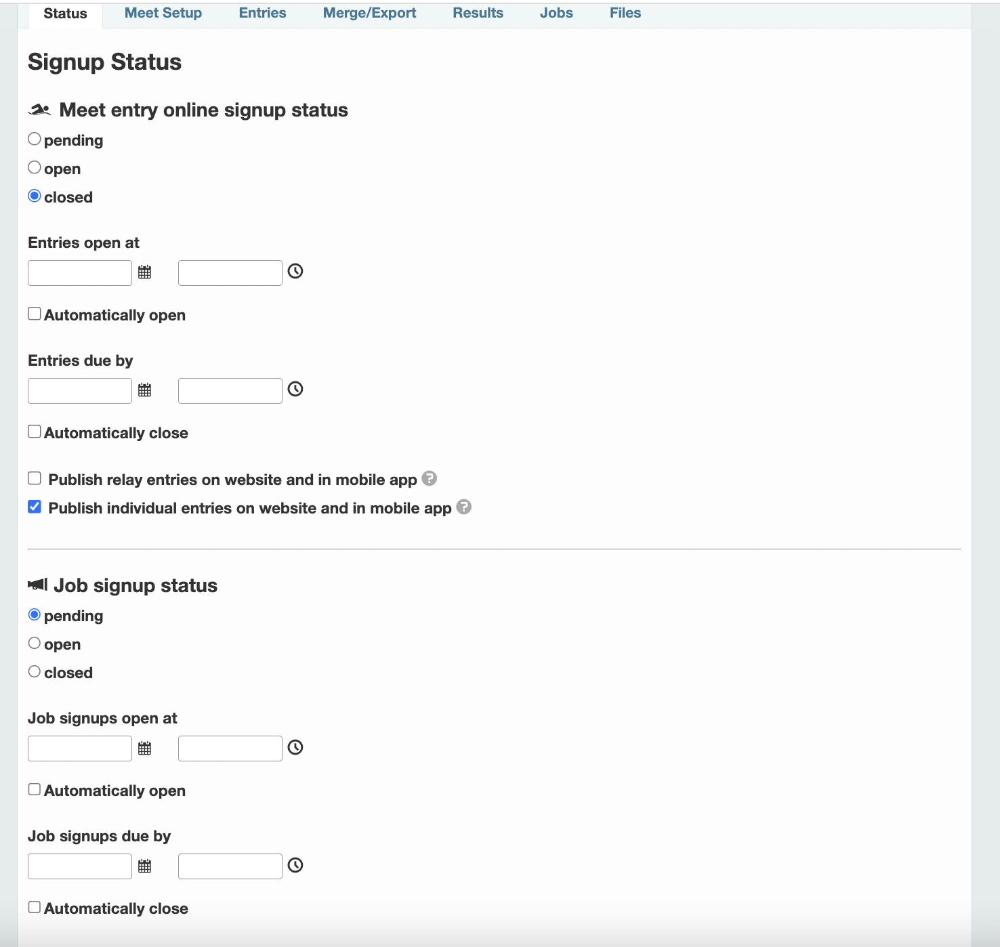

4. Apply Meet Template. Under **Meet Setup → Entries**, Click **Apply Template**. Select **[GPSA] 2024 GPSA Dual Meet (56 Events)**.

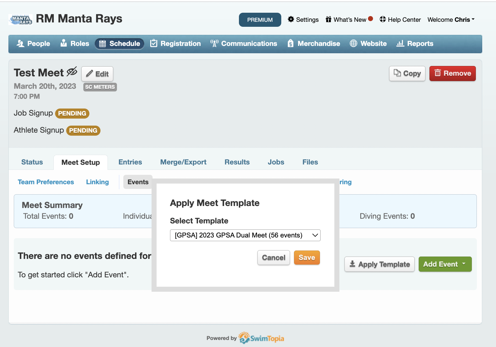

## Swimmer Entries

### Point Swimmers

Swimmer entries can be completed by clicking the pencil icon next to each swimmer's name and checking the box for each event.

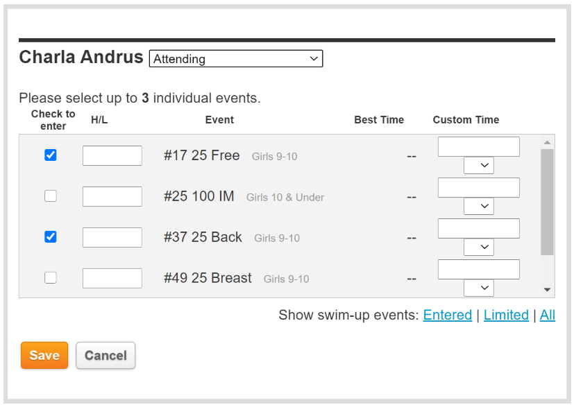

Bulk entries can be completed by clicking **Edit Entries** in the upper right hand corner.

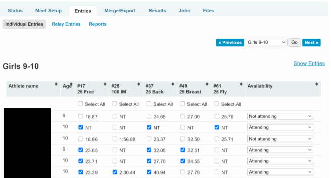

### Declare Exhibition Swimmers

To aid in the automatic seeding and scoring of the meet using Meet Maestro, exhibition swimmers must be declared during the entry selection process. This is accomplished using the **Exh** checkbox during swimmer entry selection as demonstrated below.

**Official Documentation:**
- [Exhibition Events/Athletes](https://help.swimtopia.com/hc/en-us/articles/211075983-Exhibition-Events-Athletes#h_01G66B6EY9PCKWM29NDX1S30YH)
- [If performed in Meet Maestro on deck](https://help.swimtopia.com/hc/en-us/articles/360010479811#h_01G667F30TV86TT8YMJE78FSB5)

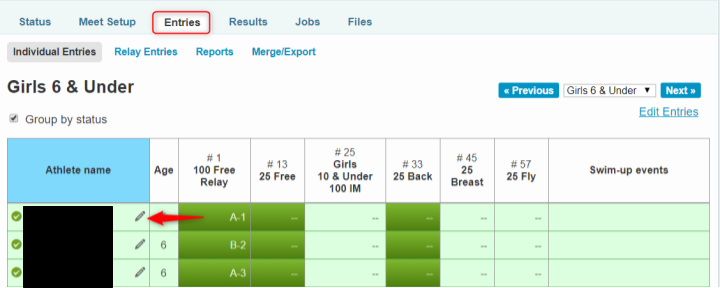

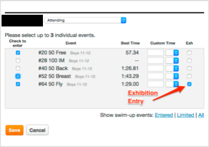

### Swimming a Swimmer "Up"

When in the detailed view of a swimmer, selecting the **All** URL in the bottom right will show all events the swimmer is eligible to swim-up in.

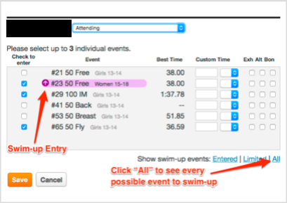

### Bonus Entry for Small Teams

To keep all teams using the same meet template, any team that meets the requirements to allow swimmers to swim in 4 individual events can do so by using the **Bon** checkbox. It is the responsibility of the GPSA rep and coach to ensure bonus entries are only used when permitted by GPSA rules.

### Building a Relay Team

Relay teams can be edited to add/remove swimmers (and specify swim-up ages), change the relay order, rearrange swimmers within the relay, enter custom seed times, and to mark a relay as an exhibition entry if necessary.

**Official Documentation:** [Edit Relay Teams](https://help.swimtopia.com/hc/en-us/articles/201748126-Automatic-Relay-Generation-and-Settings#h_01G37FJVMHDK6KCEEKSFGVMKVY)

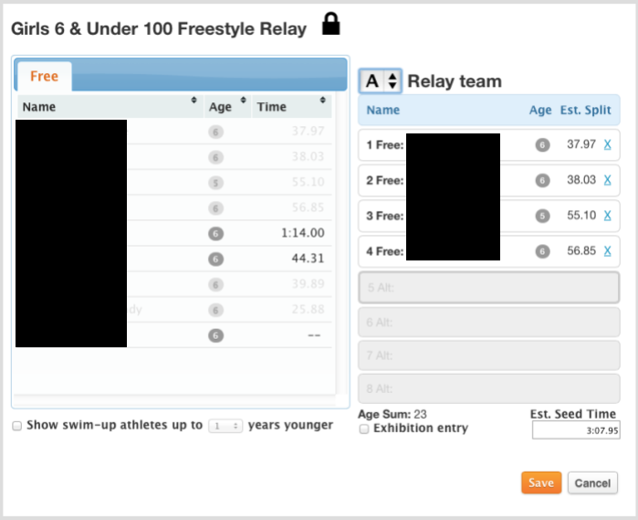

### Entries Matrix

The Entries Matrix uses the below indicators and colors to indicate the status of a swimmer.

#### Color Indicators

- **Light green** - Declared to be attending but not necessarily entered in specific events
- **Dark green** - Athlete is entered into that event
- **Grey** - Not eligible (not attending, not qualified, arriving late, or leaving early)
- **Orange** - Entered but not qualified

#### Other Indicators

- **"X"** - Exhibition Swim
- **"A"** - Alternate
- **"B"** - Bonus (doesn't count against entry limits)

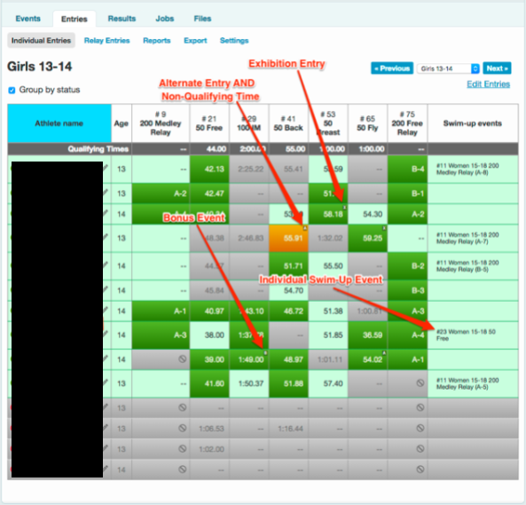

### Entry Reports

#### Meet Entries by Athlete

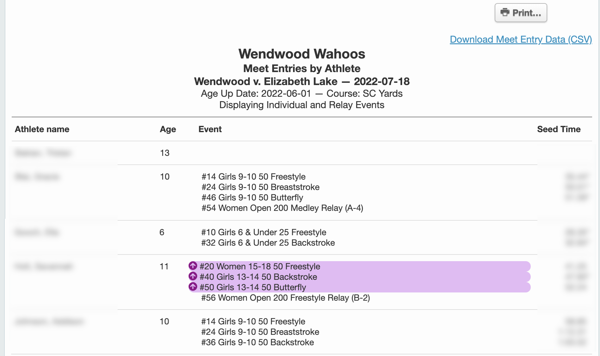

This report is helpful to validate the number of entries per swimmer. Age-up swimmers are identified by highlighting.

#### Meet Entries by Event

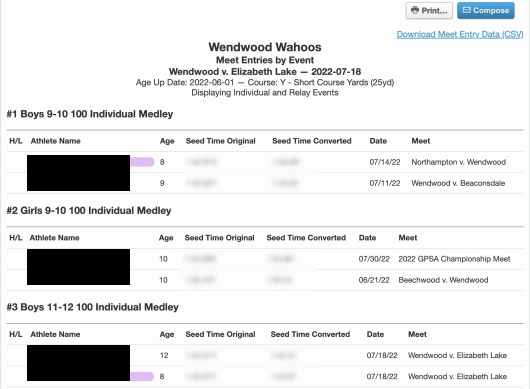

This report is helpful to ensure every event has the proper number of point swimmers. Age-up swimmers are identified by highlighting.

## Merge Entries

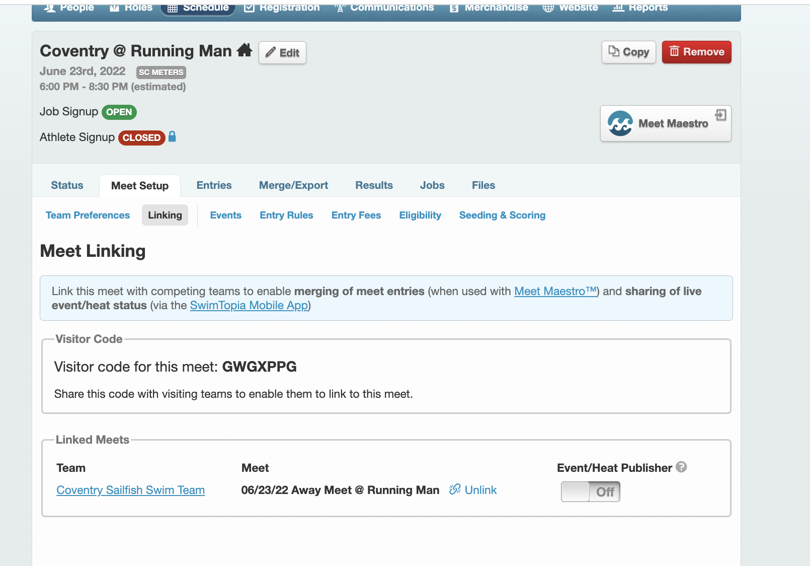

### Setting Up Meet Linking

1. Select a meet from the Schedule
2. Click on the **Meet Setup** tab
3. Click on the **Linking** subheader
4. The home team should share the meet code with the visiting team

### Visiting Team Process

The visiting team will need to:

1. Select the specific meet from the Schedule
2. Click on the **Meet Setup** tab
3. Click on the **Linking** subheader
4. Enter the visitor code that was shared by the home team

**Note:** Meet linking for GPSA scheduled meets will be done by SwimTopia when we submit our season schedule for import. This will only be necessary for custom meets.

### Merging Entries

Once both teams have completed all swimmer entries:

1. Select the **Merge/Export** tab
2. Click the slider beside your team's name to indicate you are ready to merge
3. Once both teams have submitted as ready, the home team will be able to merge the entries and build the meet in Meet Maestro

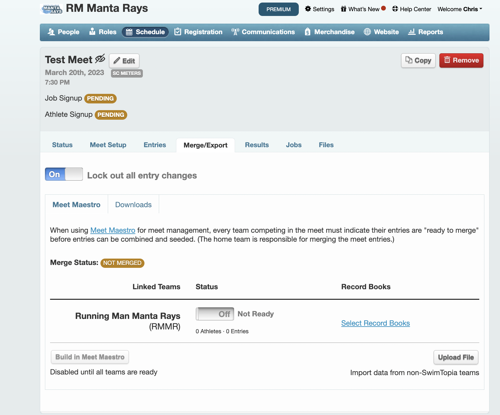

## Various Pool Configurations

In GPSA, we have pools with 4, 5, 6, and 8 lanes. For pools with 4, 5, and 6 lanes, lanes 1-4 will be used for scoring lanes in heat 1. For the 8 lane pool, the middle 4 lanes will be used for the scoring lanes in heat 1.

The configuration setting for number of lanes can be found in Meet Maestro, under **Settings → Meet Setup** in the **Pool Configuration** box, as shown below.

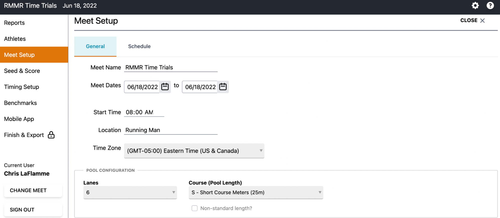

## Adding Record Book and Qualifying Times to the Meet

### Adding Record Books

To add Team and Pool records to a meet:

1. Select the meet from the Schedule
2. Click on the **Merge/Export** tab
3. Click on **Select Record Books**
4. Check each record book you wish to apply to this meet

### Adding City Meet Qualifying Times

To add the City Meet Qualifying Time Standard to a meet:

1. Launch Meet Maestro
2. Click on the **Settings Gear** on the top right
3. Select **Benchmarks** from the left side menu
4. Click the **Add Time Standard** button
5. Select the listed City Meet Qualifying Times

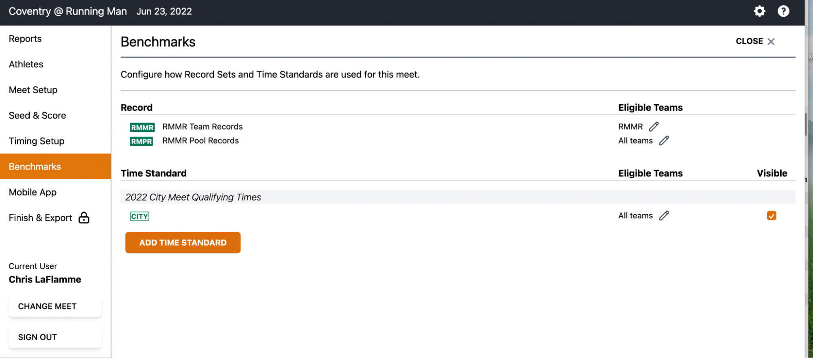

## Creating Heat Sheets

In Meet Maestro, click on the **Settings Gear** on the top right. Select **Reports** from the left side menu. Click on **Heat Sheet**.

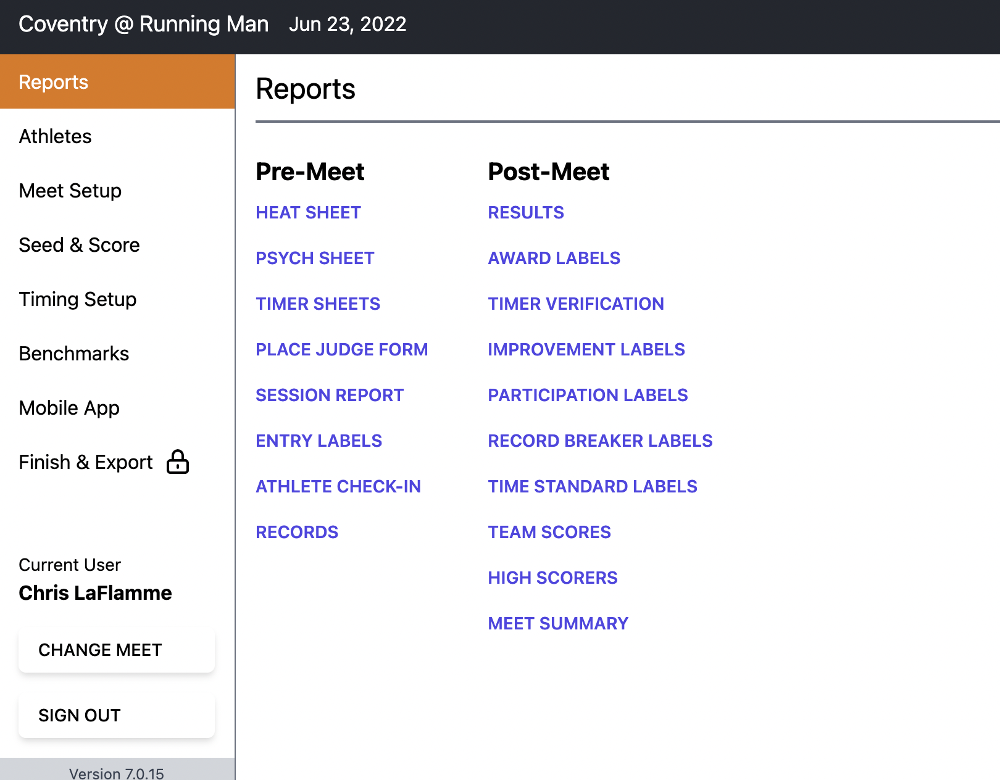

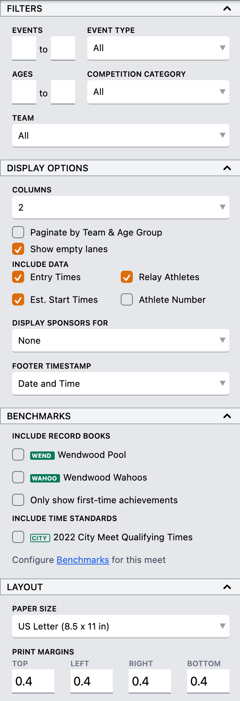{height=956 width=327}

### Heat Sheet Options

There are many options available when generating Heat Sheets:

- **Team filter** - Create a "sanitized" Heat Sheet to print and share with your team
- **Benchmarks** - Include City Meet Qualifying Times for each event on the heat sheet

## Running the Meet

### Keeping the Score Blind

Per GPSA rules, meet scores must remain hidden until all events are complete.

Once a meet has been merged, a link to Meet Maestro will appear on the upper right portion of the screen. Click the **Meet Maestro** button to access the Meet.

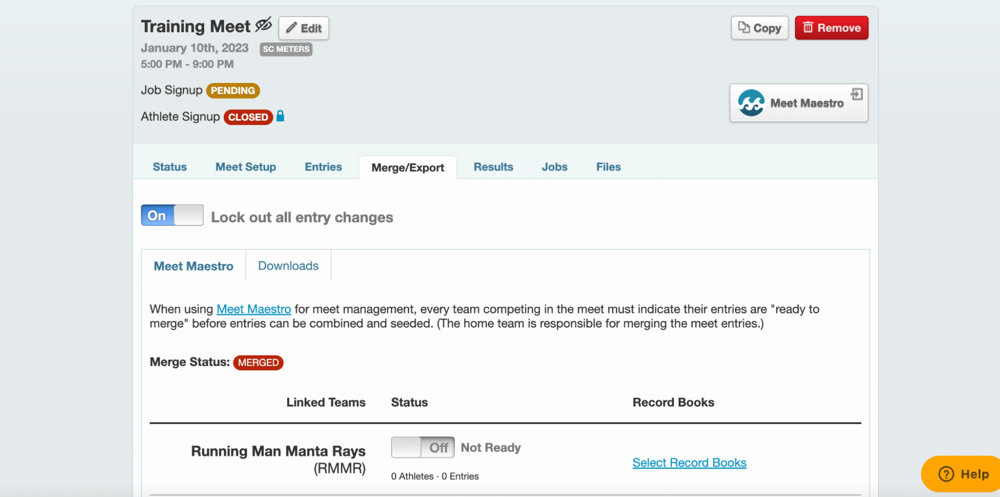

Once in Meet Maestro, click on the **Settings Gear** on the upper right portion of the screen.

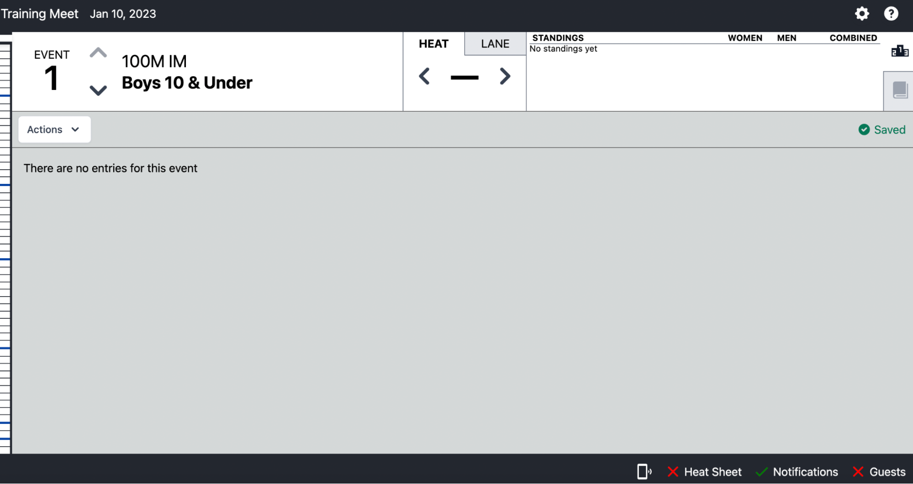

Once in the Settings menu, click on the **Mobile App** subheader on the far left. In the middle of the screen, there will be sliding options (**Score Display**) to turn Combined/Men/Women scoring off. This will prevent any scoring from displaying on the mobile app.

### Manual Timing System

Manual timing is equivalent to using stopwatches (battery operated, digital read-out) to record the duration of the individual swim.

**Starting the Watch:**
- Start at the instant of observing the visual starting signal
- If the visual starting signal is not observed, start upon hearing the starting signal

**Stopping the Watch:**
- Stop when any part of the swimmer touches the wall at the completion of the distance of the event
- Record times to the hundredths place (two decimals) with no rounding

**Timer Requirements:**
- **One timer:** Recorded time is the official time
- **Two timers:** Average the recorded times to determine the official time
- **Three timers:** Use the intermediate (middle) time as the official time

### Semi-Automatic Timing System

A Semi-Automatic Timing System begins automatically with an electronic signal from the starting unit and ends manually when the timer pushes their button at the finish of the race.

**Process:**
- System starts automatically with electronic starting signal
- Timer presses button when any part of the swimmer touches the wall
- Times are automatically transmitted to a central system integrated with Meet Maestro

**Timer Requirements:**
- **One timer:** Recorded time is the official time
- **Two timers:** Average the recorded times to determine the official time
- **Three timers:** Use the intermediate (middle) time as the official time

## Official Roles

### Meet Ref Role

The Meet Referee is responsible for overseeing all aspects of the meet and ensuring compliance with swimming rules.

**Official Rules:** [USA Swimming Rulebook - Article 102.11](https://www.usaswimming.org/docs/default-source/rules-regulations/2023-rulebook.pdf)

**Additional Training:** [Officials Training Materials](https://www.teamunify.com/team/va/page/officials/official-training)

### Starter Role

The Starter is responsible for ensuring fair and legal starts for all races.

**Official Rules:** [USA Swimming Rulebook - Article 102.12](https://www.usaswimming.org/docs/default-source/rules-regulations/2023-rulebook.pdf)

**Additional Training:** [Officials Training Materials](https://www.teamunify.com/team/va/page/officials/official-training)

### Timer Role

Timers record the official times for each swimmer in their assigned lane.

**Official Rules:** [USA Swimming Rulebook - Article 102.16](https://www.usaswimming.org/docs/default-source/rules-regulations/2023-rulebook.pdf)

### Stroke and Turn Role

Stroke and Turn Judges ensure swimmers comply with stroke rules and proper turns.

**Official Rules:**
- [USA Swimming Rulebook - Article 101 (Strokes)](https://www.usaswimming.org/docs/default-source/rules-regulations/2023-rulebook.pdf)
- [USA Swimming Rulebook - Article 102.13](https://www.usaswimming.org/docs/default-source/rules-regulations/2023-rulebook.pdf)

**Additional Training:** [Officials Training Materials](https://www.teamunify.com/team/va/page/officials/official-training)

### Sweep Judge Role

Sweep Judges determine the official order of finish for each heat.

**Official Rules:** [USA Swimming Rulebook - Article 102.13.2](https://www.usaswimming.org/docs/default-source/rules-regulations/2023-rulebook.pdf)

Each team will provide a Sweep Judge and each will independently record the Order of Finish across the 4 scoring lanes.

**Form:** [Sweep Judge Order of Finish Form](https://drive.google.com/file/d/1qF-M9VYFpAfvxB6xZ2-HMnbI2uz9_fGK/view?usp=sharing)

**Dispute Resolution:** If judges do not agree on the order of finish, see [GPSA Rules - Article XV.A.6](https://drive.google.com/file/d/1Wh39Z_TIjtHMR5Rcxmbd5r3es-hDWB5f/view?pli=1). The Referee may settle the order of finish if personally observed or declare a tie.

### Runner Role

The Runner is responsible for collecting all lane slips from the timers and delivering them to the Sweep Judges for review. The Runner is also responsible for collecting DQ slips from Stroke and Turn Judges and delivering to the Meet Ref. After the Meet Ref has reviewed lane slips and DQ slips for a particular event, the Runner may be asked to deliver those artifacts to the Scoring Table for processing.

### Scorekeeper Role

Each team will provide a scorekeeper. The scorekeepers will perform two functions:

1. Record the official time collected by the timer on to the scoresheet or exhibition sheet
2. Record the placement for the 4 swimmers competing in scoring lanes

#### Using Meet Maestro as Scorekeeper

1. Select the appropriate meet from the Schedule

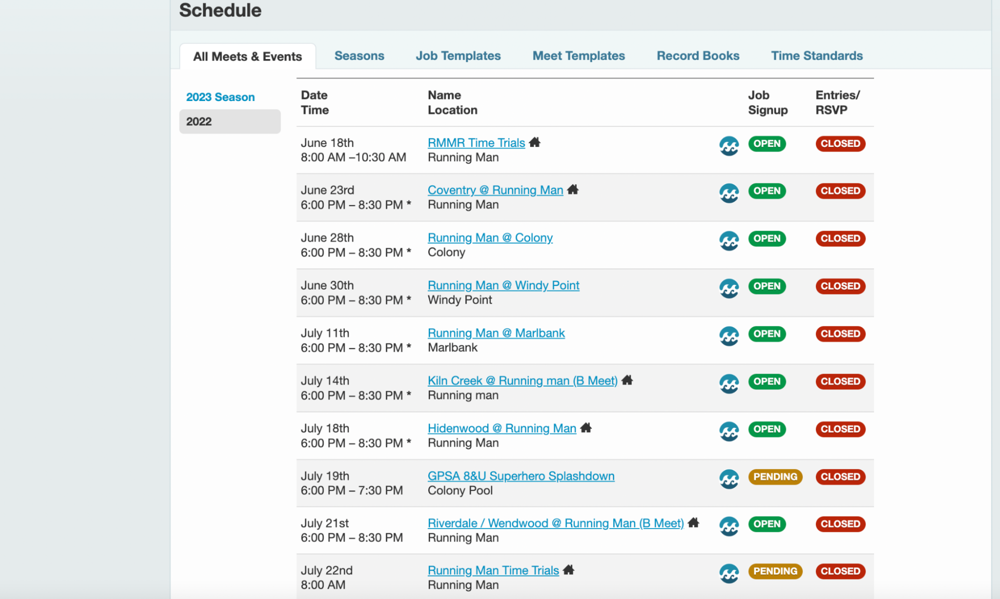

2. Click the **Meet Maestro** button to actively manage the meet

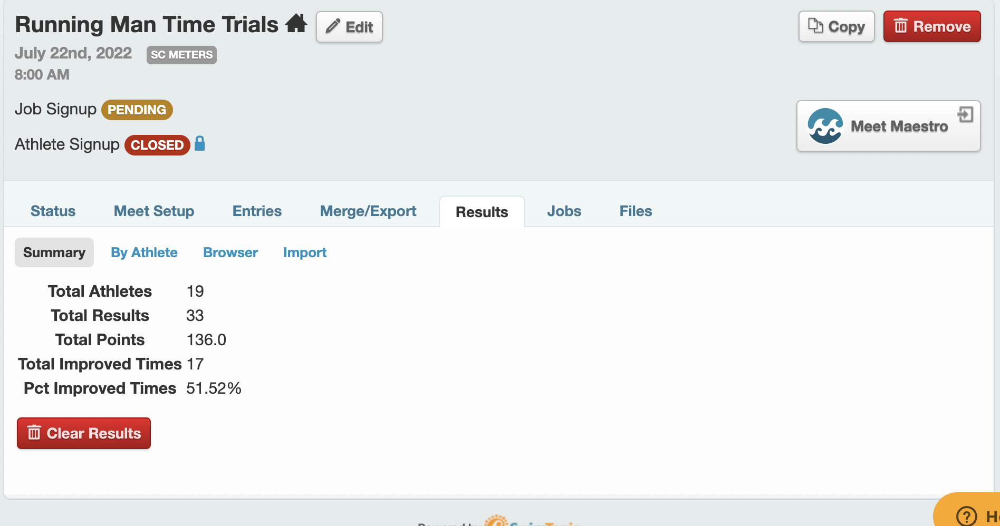

3. Once in Meet Maestro, scorekeepers can navigate heat to heat, event to event, using the left and right arrows at the top-middle of the screen

4. **If using stopwatches and lane slips:**
   - Scorekeepers will receive a collection of lane slips for each event from the Meet Ref or the Runner
   - Match the lane slip to the entry in Meet Maestro (swimmer's name, team, heat, and lane should all match)
   - Record the time collected on the lane slip into the box labeled **Timer 1**
   - Denote the placement in the **Heat Place** column (points populate automatically)
   - Exhibition lanes should already be marked
   - If there is a DQ slip attached to the lane slip, mark the **DQ** column and select the code checked on the DQ slip

5. **If using Time Drops:**
   - Scorekeepers will click the **Load Times** button to retrieve the times recorded by Time Drops
   - The Meet Ref or Runner will drop off a card with the official order of finish
   - Record this in the **Heat Place** column (points populate automatically)
   - Exhibition lanes should already be marked
   - If there is a DQ slip attached, mark the **DQ** column and select the code checked on the DQ slip

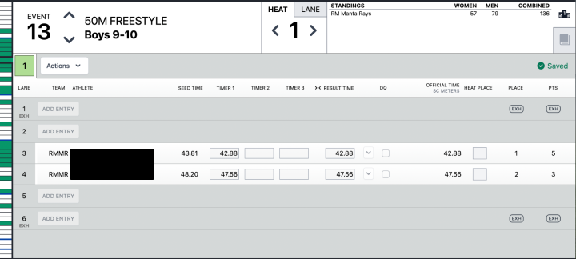

6. Once all entries have been completed, review the collection of events with the Meet Ref who will sign off on the meet

### Ribbon Writer / Labeler

Each team will provide a Ribbon Writer for the meet. Once the Scorekeepers have completed their time entries for a particular event, they will hand the associated lane slips to the Ribbon Writers to label the award ribbons accordingly. These can be written manually or labels can be generated from Meet Maestro.

#### Generating Award Labels

To generate labels, launch Meet Maestro for the active meet and click the **Settings Gear** on the top right of the screen.

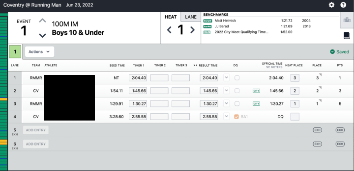

Once in the Settings, select the **Reports** tab on the left side of the screen.

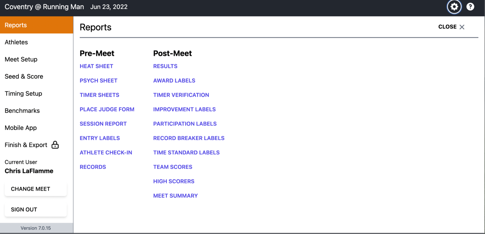

#### Heat Place Labels

Click on **Award Labels**. Configure settings:

- **Award Type:** Heat Place
- **Heats:** 1 of 1
- **Individual Places:** 1 to 4

This will generate Award Labels for Heat 1 placement only. Once the report is generated, click the **Printer** icon to send to the Printer.

**Label Stock:** Use Avery 8160 for inkjet printers or Avery 5160 for laser printers.

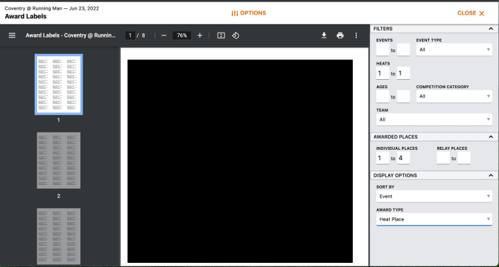

#### Participation Labels

Next, click on the **CLOSE** link on the top right to return to Reports. Click on **Participation Labels**. Select **Exhibition / Non-Placing Only**. This will generate all the Exhibition labels. Once the report is generated, click the **Printer** icon to send to the Printer.

**Label Stock:** Use Avery 8160 for inkjet printers or Avery 5160 for laser printers.

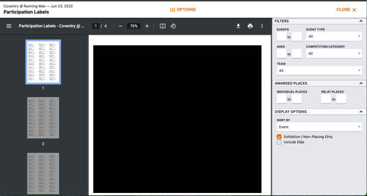

## Flow of an Event

This section describes the complete flow of a single event from start to finish:

1. **Call swimmers behind blocks**
   - The Meet Ref will issue a series of 4-5 short whistles, signaling the swimmers behind the block to get ready for the next heat

2. **Announce the event**
   - Announcer/Starter will announce the event/heat

3. **Step up to blocks**
   - Once the Meet Ref can see that the swimmers are behind the block and ready, the Meet Ref will blow 1 long whistle inviting the swimmers to step up on the block

4. **Hand off to Starter**
   - Once the swimmers are on the block, the Meet Ref will extend their arm, clearly visible to the Starter
   - This action hands the control of the heat to the Starter

5. **Start the race**
   - The Starter will invite the swimmers to 'Take Your Marks'
   - Once each swimmer has obtained a set position, the Starter will engage the starting unit, thus beginning the heat

6. **Record finish times**
   - As the swimmers approach the wall for the completion of the swim, the timers should position themselves such that they can clearly observe the swimmer touching the wall
   - At the moment the swimmer touches the wall, the timer should stop their watch or press the button on the Time Drops device
   - Record the time to the nearest hundredths

7. **Signal next heat**
   - The Meet Ref will issue a series of 4-5 short whistles, signaling the start of the next heat/event
   - This action will start this process over again for the subsequent heat/event

8. **Collect lane slips**
   - The Runner should collect all lane slips and deliver them to the Sweep Judges, who will collectively determine the 'Order of Finish' (if lane slips are used)

9. **Collect DQ slips**
   - If the Runner has any DQ slips collected from the Stroke and Turn Judges, they should be delivered to the Meet Ref for final adjudication

10. **Determine order of finish**
    - The Sweep Judges will hand over the 'ordered' lane slips or card with the Order of Finish to the Meet Ref
    - The Meet Ref will flag any lane slips with any accompanying DQ
    - This may change the order of finish depending on the disqualified participants (For example, if the second place swimmer is disqualified, the third and fourth place finishers will be promoted in the order of finish accordingly)

11. **Deliver to scorekeepers**
    - The Meet Ref, or Runner if directed by the Meet Ref, will deliver the ordered lane slips with accompanying DQ slips to the Scorekeepers for processing
    - If not using lane slips, order of finish cards/slips will be turned in

12. **Record results**
    - The Scorekeepers will record the times and placement (for scoring heats) on the scoresheet or directly in SwimTopia
    - DQs should be denoted as well
    - If the lane slips are for an exhibition swim, the times should be recorded on the exhibition sheet or denoted as exhibition within SwimTopia

13. **Process ribbons**
    - The Scorekeepers will hand the lane slips to the Ribbon Writers for processing

## Export Meet Results to Teams Repository

After the meet is complete and all results are entered:

1. In Meet Maestro, click on the **Settings** gear located on the top right of the screen

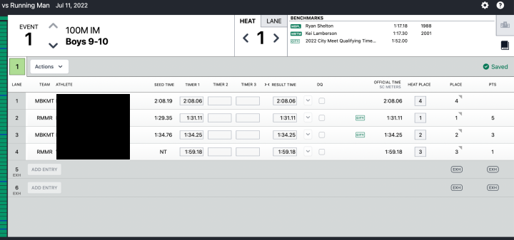

2. Next, click on **Finish and Export** on the left side menu panel

3. This screen will allow you to transfer meet results to each team by clicking on the **Transfer Results** button

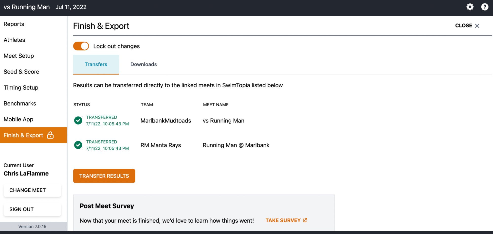

---

## Additional Resources

- [SwimTopia Help Center](https://help.swimtopia.com/)
- [GPSA Scorekeeper Guide](scorekeeper.md) - Detailed Meet Maestro instructions
- [Time Drops Timing System](time-drops-about.md) - Semi-automatic timing system used by many GPSA teams
- [USA Swimming Rulebook](https://www.usaswimming.org/docs/default-source/rules-regulations/2023-rulebook.pdf)

**Questions?** Contact the GPSA webmaster or your division representative for assistance.
