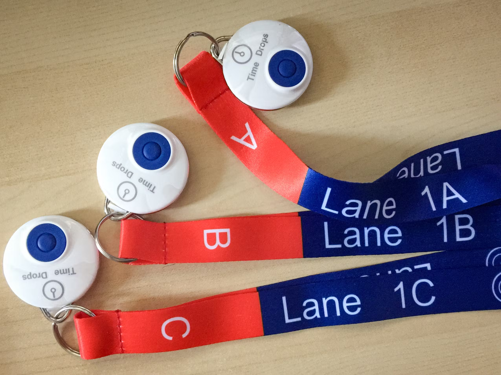
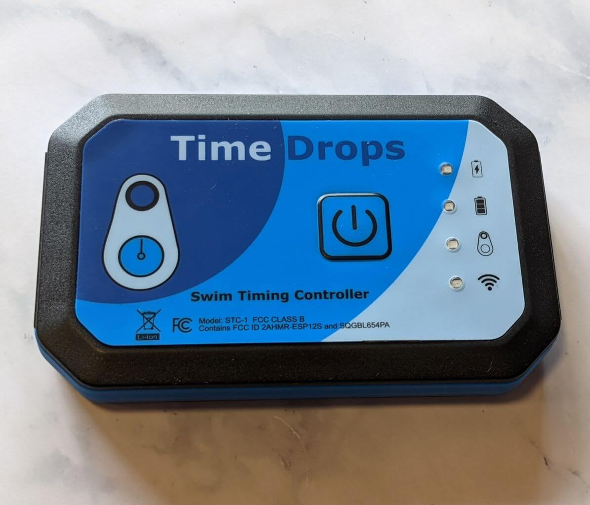

The **Time Drops Wireless Swim Timing System** is used by over half of the teams in GPSA for electronic timing at swim meets. This system uses wireless keyfob-style timer buttons instead of traditional wired plunger systems.

## What is Time Drops?

Time Drops is a **wireless electronic timing system** consisting of dedicated hardware components:

- **Wireless timer buttons (PB-2)** - Keyfob-style devices that timers press when swimmers touch the wall
  
- **Timing controller (STC-1)** - The "heart" of the system with a precision reference clock
  
- **Start adapter (SA-1)** - Wirelessly receives signals from starting systems
  
- **Android tablet** - Runs the Time Drops Console app to manage the system
- **Windows laptop** - Runs MM-Link software to bridge to meet management software (Hy-Tek Meet Manager or SwimTopia Meet Maestro)

### How It Works

1. Timers at the end of each lane hold wireless button devices on lanyards
2. When a swimmer touches the wall, timers press their buttons
3. Button presses are transmitted wirelessly to the STC-1 controller
4. The controller's precision clock timestamps each button press
5. Times are sent via Wi-Fi to the Android tablet
6. The tablet evaluates results and sends data to the Windows laptop
7. MM-Link software exports results to meet management software

### Why Teams Use Time Drops

**Benefits:**

- **Cost-Effective** - Less expensive than traditional electronic timing systems
- **Wireless** - No cables to set up or manage at poolside
- **Quick Setup** - System ready in minutes, not hours
- **Portable** - Lightweight keyfob buttons instead of heavy plungers
- **Accurate** - Precision reference clock (deviation < 0.01s/hour)
- **Water Resistant** - Buttons are IP67 rated (can survive pool submersion)

## System Components

### Timing Controller (STC-1)

The controller is the core of the system:

- **Precision Clock:** Factory-calibrated TCXO with deviation under 0.01 seconds/hour
- **Wireless:** 2.4 GHz wireless communication with ~1000 ft range (open terrain)
- **Battery:** Rechargeable Li-Poly battery (10-hour operation)
- **Water Resistance:** IP65 rating (splash-resistant)
- **Dimensions:** 125 x 79 x 21 mm

The controller manages wireless communication with buttons, start adapter, and tablet.

### Timer Buttons (PB-2)

Keyfob-style wireless buttons given to timers:

- **Operation:** Single soft-touch button press (no configuration needed)
- **Battery:** CR2032 coin cell (500+ hours of continuous operation, 2-3 years typical use)
- **Water Resistance:** IP67 rated (can survive pool submersion)
- **Range:** ~1000 feet in open terrain (reduced by walls/crowds)
- **Weight:** Approximately 1 ounce
- **Color-Coded Lanyards:** Included for lane identification

**Typical Configuration:** 3 buttons per lane plus spares

### Start Adapter (SA-1)

Wirelessly connects to swim starting systems:

- **Compatibility:** Works with CTS, Daktronics, IST, SST starting systems
- **Battery:** CR123A (2000+ operating hours)
- **Connection:** Dual banana jack for starter system output
- **Optional Touchpad Support:** Can integrate with touchpads for fully automatic timing

**Alternative:** Mini-Starter (ST-1) available if team doesn't have a starting system

### Android Tablet

Controls the timing system via Time Drops Console app:

- **Requirements:** Android 7.1+ (Amazon Fire tablets supported)
- **Recommended:** 8-10 inch tablets
- **Function:** Manages timers, scoreboards, and exports results
- **Connection:** Wi-Fi to controller and laptop

### Windows Laptop

Runs MM-Link software for meet management integration:

- **Requirements:** Windows 10
- **Software:** MM-Link (free from Microsoft Store)
- **Function:** Bridges between tablet and meet management software
- **File Exchange:** Creates shared folder for SDIF file transfer

## GPSA Usage

### League Adoption

Over 50% of GPSA teams currently use Time Drops for dual meets. The system integrates with:

- **SwimTopia Meet Maestro** - For GPSA meet management

### GPSA Meet Best Practices

For the best meet experience with Time Drops it is recommended:

- Maintain **manual backup timing** with stopwatches
- Use a dedicated travel router for the timing system Wi-Fi like the [GL.iNet GL-SFT1200](https://www.amazon.com/GL-iNet-GL-SFT1200-Secure-Travel-Router/dp/B09N72FMH5?crid=L8UXFKV9RNMW&dib=eyJ2IjoiMSJ9.Iacoh3kugJDfgFKiXO0fTtaZvj0YSn1x0chmEu_VWjnFxnk_q2vc8ux2Eq9_mVUrxaT6zcSKR-vWOAeQqWL20B5SECTgpVvfkgTtcJZnuEooWRS0EPaTv_a_e-2olfr2S1uY1FkgwZ06mX69C4sbHUg0pFfZqsGspvTnM6zLjeIVXy_PTYOG0Cb6jIZY4Ngir7MlnHZwsxZej-_sl3PhYQC3qVTatqIAoLJ55QkiGrfJM_fGDCt-GGa6hiR0SzMEWTKi9RfjIk-pP5TrlIrRbxrQavjuUmhgyo7qnNex19I.yKuv3a-yzrSfJsUM-aYX2BDji5RuNjyXYRV71nzsMtU&dib_tag=se&keywords=gl.inet%2Btravel%2Brouter&qid=1768407065&s=electronics&sprefix=gl.inet%2Btravel%2Brotuer%2Celectronics%2C431&sr=1-7&th=1)
- Place the travel router in a position with a clear view of the laptop, tablet, and STC-1 controller
- Train volunteers on system operation
- Follow GPSA event order and scoring rules

**Important:** Manual backup times are official **only** if the electronic system fails.

## Setting Up at a Meet

### Hardware Setup

1. **Controller (STC-1)**
   - Place near pool edge with clear line of sight to timer positions
   - Press power button to turn on
   - LED will flash slowly (not connected) or double-flash (connected to Wi-Fi)
   - Operates for 10 hours on full charge

2. **Timer Buttons (PB-2)**
   - Distribute buttons on color-coded lanyards to timers
   - Click once to turn on (auto-off when controller powers down)
   - Each lane typically has 3 buttons (A, B, C positions)
   - Battery life: 500+ hours continuous operation

3. **Start Adapter (SA-1)**
   - Connect dual banana jack to starting system "START OUTPUT"
   - Attach adapter with velcro pad
   - Perform test start to power on
   - LED indicates connection status

### Software Setup

1. **Android Tablet**
   - Install "Time Drops Wireless Swim Timing Console" from Google Play
   - Connect to pool Wi-Fi network
   - Configure controller connection (one-time setup)
   - Assign buttons to lanes in "Manage Buttons" screen

2. **Windows Laptop**
   - Install MM-Link from Microsoft Store
   - Create shared folder (e.g., `C:\TimeDrops`)
   - Configure same folder in meet management software
   - Ensure laptop connected to same Wi-Fi network

### Wi-Fi Requirements

**Recommended Setup:**

It is recommended that teams use a dedicated Wi-Fi appliance for the timing system and laptop operation such as the **GL-iNet GL-MT3000** ([available on Amazon](https://www.amazon.com/dp/B0BPSGJN7T)).

- **Placement:** Position the Wi-Fi appliance on the scorekeeper table near the laptop and Time Drops controller
- **Internet Access:** Can wirelessly connect to the pool's existing Wi-Fi network or a mobile hotspot for internet access
- **Benefits:** Dedicated network for timing system, no interference from general pool users

**Requirements:**

- **Important:** Controller operates on 2.4 GHz band only
- **Backup Option:** Mobile phone hotspot or 4G/5G hotspot
- **Reliability:** Avoid sharing Wi-Fi with general pool users

## Running a Meet

### Meet Director Workflow

1. **Pre-Meet**
   - Seed meet in SwimTopia Meet Maestro
   - Export meet program to shared folder
   - Tablet automatically imports program
   - Verify events display correctly on tablet

2. **During Meet**
   - System shows "READY" when ready to start
   - Starter initiates race via starting system
   - Timers press buttons when swimmers touch wall
   - Tablet evaluates times per USA Swimming rules (median of 3 buttons)
   - Results saved to shared folder after each heat

3. **After Each Heat**
   - Meet management software imports times from shared folder
   - Verify times match backup stopwatches
   - Address any timing discrepancies

4. **Post-Meet**
   - Export final results in SDIF format from **Meet Maestro**
   - Process through [GPSA Publicity Processor](https://publicity.gpsaswimming.org/tools/publicity.html)
   - Saves as `YYYY-MM-DD_TEAM1_v_TEAM2.html`

### Timer Instructions

**Responsibilities:**

1. Receive assigned lane button(s) on lanyard
2. Stand at end of pool in assigned lane
3. Watch swimmer throughout race
4. **Press button when swimmer touches wall at finish**
5. Keep backup stopwatch ready
6. Report any equipment issues immediately

**Important Notes:**

- Button clicks are timestamped instantly (no transmission delay affects accuracy)
- Timers do NOT need to watch the tablet - just press when swimmer touches
- If button drops in pool, retrieve quickly (IP67 rated but minimize water exposure)

### Time Evaluation Rules

System follows USA Swimming rules:

- **3 buttons pressed:** Median time is official
- **2 buttons pressed:** Average of two times (yellow indicator, auto-accepts after delay)
- **1 button pressed:** Single time shown in red (requires manual acceptance)
- **0 buttons pressed:** Lane must be marked empty or times manually entered

## Integration with SwimTopia Meet Maestro

**Setup:**

1. Go to Settings → Timing Setup
2. Click "Add Timing System Configuration"
3. Select "Time Drops"
4. Choose shared folder path (must match MM-Link)
5. Click "Activate Connection"

**During Meet:**

- Meet Maestro monitors shared folder for result files
- Click "LOAD TIMES" button to import results for each heat
- System matches by race number

## Exporting Results to GPSA

### SDIF Export Process

1. Complete all meet events
2. Verify final scores in meet management software
3. Export results in SDIF/SD3 format
4. File will be in shared folder or downloadable from meet software

### Using GPSA Publicity Processor

1. Navigate to [GPSA Publicity Processor](https://publicity.gpsaswimming.org/tools/publicity.html)
2. Upload exported .zip or .sd3 file
3. Click "Process Results"
4. Review formatted output
5. Click "Export as HTML"
6. Save as `YYYY-MM-DD_TEAM1_v_TEAM2.html`
7. Submit to GPSA webmaster for archiving

See [Publicity Processor wiki page](publicity-processor.md) for detailed instructions.

## Advanced Features

### Time Drops Live

Optional feature that publishes meet results to cloud for spectator viewing:

- **Mobile App:** iOS and Android apps available
- **Web Access:** [https://live.time-drops.com](https://live.time-drops.com)
- **Privacy:** Swimmer names are end-to-end encrypted with 4-digit PIN
- **Real-Time Updates:** Results pushed to spectators' devices instantly
- **Configuration:** Enable in Meet Settings on tablet

**Distribution:** Share QR code with PIN for spectators to access

### Combining Events/Heats

Time Drops can automatically combine events when lanes don't fill:

- **Relay Combining:** Enabled by default (e.g., Girls 9-10 relay + Boys 9-10 relay in same heat)
- **Individual Combining:** Optional setting for sparse events
- **Requirements:** Manually adjust seeding so each lane used only once across combined events
- **Export:** System automatically splits results into separate files for each event

### Touchpad Integration

System supports semi-automatic or fully automatic timing with touchpads:

- Connect one SA-1 adapter per touchpad
- Configure "Touchpads at near end" or "Touchpads at both ends" in settings
- Buttons serve as backup times
- Can start odd-lap races from far end for touchpad finish

### Split Time Collection

With "Collect splits with buttons" enabled:

- Timers press buttons at each turn
- System tracks lap times throughout race
- Useful for training and analysis
- Works with button timing only (no touchpads required)

## Pricing

**Startup Packages:**

| Package | Cost | Contents |
| --------- | ------ | ---------- |
| **Basic** | $670 | 6 lanes, 2 buttons/lane, 1 spare |
| **Standard** | $950 | 6 lanes, 2 buttons/lane, 2 spares |
| **Pro** | $1,130 | 6 lanes, 3 buttons/lane, 2 spares |

**Annual Subscriptions:**

- Seasonal (≤6 months): $200/year
- Year-round/Touchpads: $300/year
- LED Matrix Add-on: $50/year

All subscriptions include technical support, software updates, and hardware repair coverage.

**Additional Equipment:**

- Extra buttons available for pooled systems
- Scoreboard adapters sold separately
- Custom lanyards available

## Troubleshooting

### Common Issues

**Controller won't connect to tablet:**

- Check controller LED: single flash = not connected, double flash = connected
- Verify tablet connected to correct Wi-Fi network
- Go to tablet: Menu → Controller Setup → Query controller status
- Re-enter Wi-Fi password if needed (case-sensitive!)

**Button not responding:**

- Check battery (CR2032 coin cell)
- Press and hold button to identify on tablet (turns green)
- Verify button assigned to correct lane in "Manage Buttons"
- Replace battery if signal strength indicator low

**Start not registering:**

- Check SA-1 connection to starting system
- Perform test start to verify adapter powered on
- Check CR123A battery in adapter
- Verify adapter assigned to "Starter A" position in Manage Buttons

**Times not importing to meet software:**

- Verify shared folder path matches in MM-Link and meet software
- Check MM-Link shows "connected" status
- Ensure laptop on same Wi-Fi network
- Look for result files in shared folder (e.g., race_001.txt)

**Wi-Fi issues:**

- Ensure router configured for 2.4 GHz (controller doesn't support 5 GHz)
- Move router closer to timing controller
- Switch to mobile hotspot backup if available
- Check for interference from public Wi-Fi networks

### When to Use Manual Backup

Switch to manual timing if:

- Wi-Fi connection lost and cannot be restored quickly
- Controller malfunctions
- Multiple buttons fail
- Tablet unresponsive
- Any situation where electronic times cannot be reliably captured

**Per GPSA rules:** Manual backup times are official when electronic system fails.

## Best Practices

### Pre-Meet Checklist

- [ ] Fully charge controller (STC-1) battery
- [ ] Install fresh CR2032 batteries in buttons at start of season
- [ ] Check SA-1 start adapter battery (CR123A)
- [ ] Charge tablet fully
- [ ] Configure and test Wi-Fi router
- [ ] Have backup Wi-Fi source ready (mobile hotspot)
- [ ] Verify shared folder setup on laptop
- [ ] Train volunteers on button operation
- [ ] Have backup stopwatches for all lanes
- [ ] Print paper heat sheets as backup

### During Meet

- [ ] Monitor controller battery level
- [ ] Check button signal strength indicators
- [ ] Verify times match backup stopwatches
- [ ] Keep paper scoresheets updated
- [ ] Have spare buttons available
- [ ] Maintain clear line of sight from controller to timers

### After Meet

- [ ] Turn off controller (auto-off after 10 min of tablet exit)
- [ ] Collect all buttons and lanyards
- [ ] Export SDIF file for archives
- [ ] Charge controller for next meet
- [ ] Store equipment in dry location (avoid extreme temperatures)

### Maintenance

- Replace button batteries (CR2032) every other season or when low battery indicated
- Replace start adapter battery (CR123A) as needed
- Keep controller charged
- Clean buttons if dropped in pool (retrieve quickly, dry thoroughly)
- Update controller firmware when prompted by tablet app

## Comparison with Other Systems

| Feature | Time Drops | CTS Dolphin | Manual Timing |
| --------- | ------------ | ------------- | --------------- |
| **Cost** | $670-$1130 startup + $200-300/yr | $8000+ | ~$200 (stopwatches) |
| **Setup Time** | 15-30 minutes | 30-60 minutes | 5-10 minutes |
| **Weight/Portability** | Very light (1 oz buttons) | Heavy (plungers, cables) | Very light |
| **Water Resistance** | IP67 buttons, IP65 controller | Varies | N/A |
| **Wireless** | Yes | No (wired plungers) | N/A |
| **Internet Required** | Yes (Wi-Fi) | No | No |
| **Training Complexity** | Low | Moderate | Minimal |
| **Real-time Results** | Yes | Yes | No |
| **Backup Required** | Yes (manual stopwatches) | Yes | N/A |
| **Touchpad Compatible** | Yes (optional) | Yes (typical) | N/A |

## Technical Specifications

| Component | Specification |
| ----------- | -------------- |
| **Timing Resolution** | 0.00003 seconds (30 microseconds) |
| **Controller Clock Accuracy** | < 3ppm deviation, < 0.01s/hour |
| **Button Range** | ~1000 feet line-of-sight |
| **Controller Battery** | 10 hours continuous operation |
| **Button Battery** | 500+ hours operation (2-3 years typical) |
| **Water Rating (Buttons)** | IP67 (submersible) |
| **Water Rating (Controller)** | IP65 (splash-resistant) |
| **Wireless Frequency** | 2.4 GHz |
| **Button Weight** | ~1 ounce |

## Official Resources

### Time Drops Documentation

- **Official Website:** [time-drops.com](https://time-drops.com)
- **User Manual:** Available as PDF download from website
- **Video Tutorials:** YouTube channel with setup and operation guides
- **Support Email:** [support@time-drops.com](mailto:support@time-drops.com)
- **Address:** 1839 Ygnacio Valley Rd #165, Walnut Creek, CA 94598

### App Downloads

- **Android Tablet App:** "Time Drops Wireless Swim Timing Console" on Google Play
- **MM-Link (Windows):** ([Microsoft Store](https://www.microsoft.com/store/apps/9MV7DPML9LC2))
- **Time Drops Live! (iOS):** App Store
- **Time Drops Live! (Android):** Google Play
- **Web Access:** [live.time-drops.com](https://live.time-drops.com)

### SwimTopia Integration

- **Help Article:** SwimTopia Help Center - Time Drops Integration
- **Video Guide:** [YouTube tutorial](https://youtu.be/f-QSTBUsA7U)

## GPSA-Specific Information

### Teams Currently Using Time Drops

*This section can be updated with specific team contacts willing to help other teams.*

### Training Opportunities

- Contact teams experienced with Time Drops for hands-on training
- Attend GPSA team representative meetings for system demonstrations
- Request demo at pre-season officials training

### Pooling Equipment

Teams can pool buttons from multiple Time Drops systems for larger meets:

- Reconfigure for additional lanes in Settings
- Assign extra buttons in "Manage Buttons" screen
- Contact Time Drops for additional numbered lanyards

## FAQ

### Is Time Drops required for GPSA teams?

No. Teams may use any timing system (or manual timing) that meets GPSA meet requirements and integrates with Meet Maestro.

### What happens if buttons fall in the pool?

The PB-2 buttons are IP67 water resistant and will continue to function after pool submersion. However, retrieve them quickly to minimize water exposure. Dry thoroughly before storage.

### How long do button batteries last?

CR2032 batteries last 500+ hours of continuous operation, typically 2-3 years of recreational swim team use. Replace batteries at the start of every other swim season as preventive maintenance.

### Can we use Time Drops without internet?

Wi-Fi is required for communication between controller, tablet, and laptop. Internet connection is recommended but not strictly required for basic timing. However, Time Drops Live! requires internet for spectator access.

### What if our Wi-Fi fails during a meet?

Immediately switch to manual backup timing per GPSA rules. This is why manual stopwatches and lane timer sheets are required as backup.

### Can Time Drops handle championship meets?

Yes. Time Drops is designed for meets of any size. Teams can pool buttons from multiple systems to configure for more lanes. See "Pooling Equipment" section.

### How do results get exported to SDIF?

Meet management software (Meet Maestro) creates SDIF export files. These can then be processed through the GPSA Publicity Processor to generate formatted HTML results.

### Do timers need to watch the tablet screen?

No. Timers should focus on watching their assigned swimmer. When the swimmer touches the wall, press the button. The tablet automatically evaluates times and doesn't require timer monitoring.

---

**Need Help?** Contact your team's Time Drops administrator, other GPSA teams using the system, or email Time Drops support at [support@time-drops.com](mailto:support@time-drops.com).
